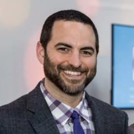
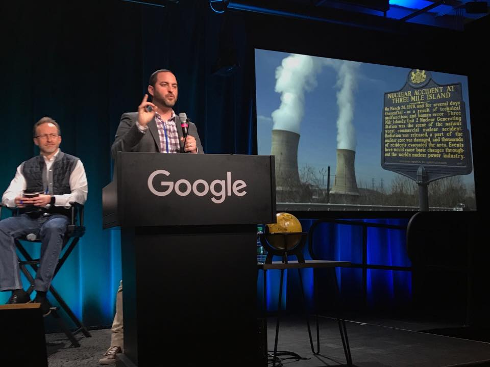
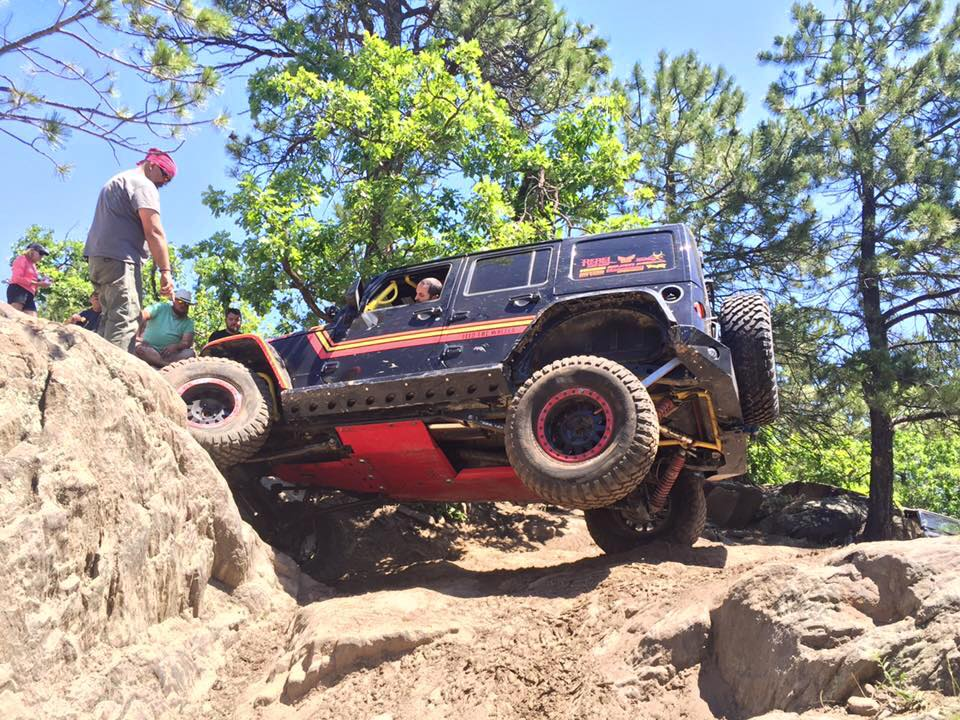
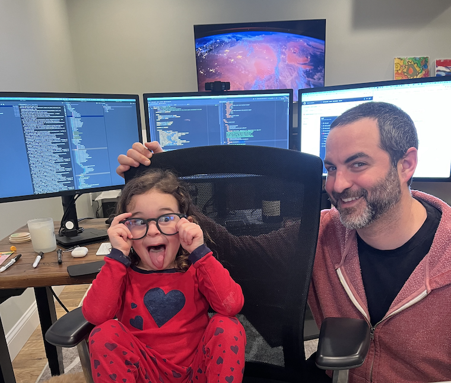
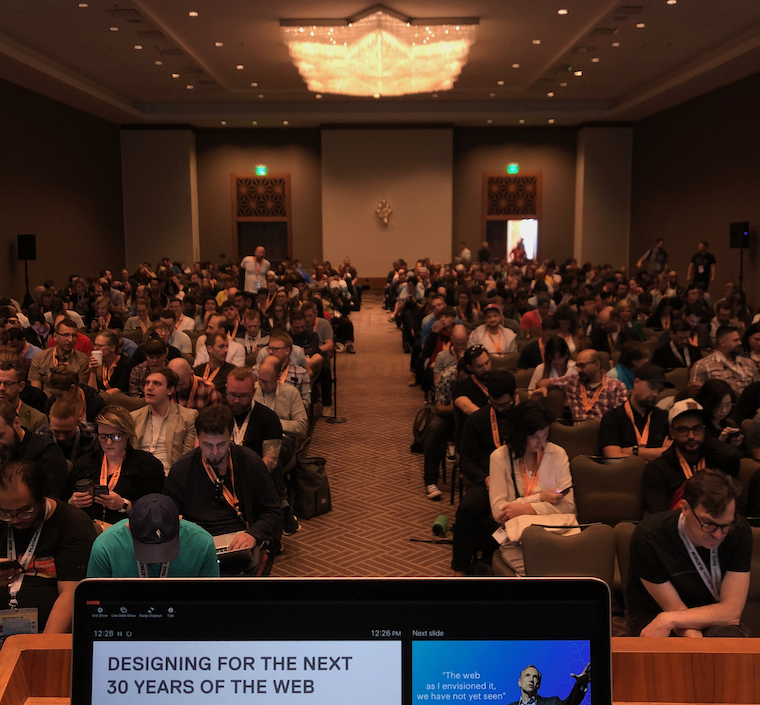
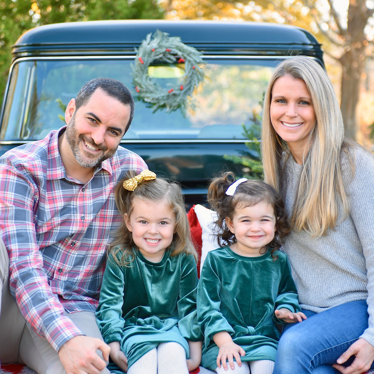
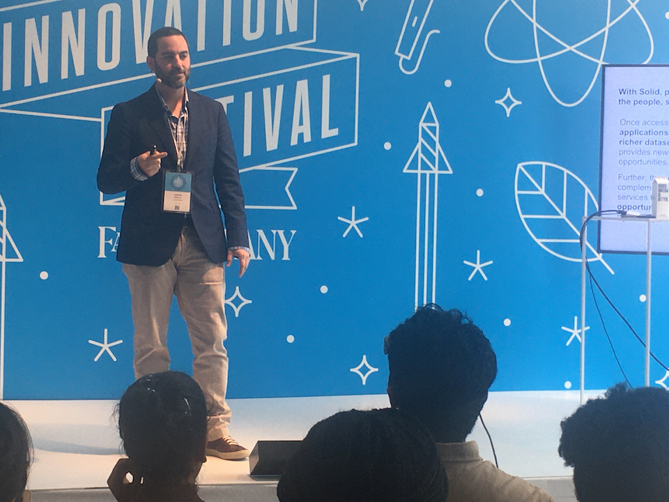

## About Me

I've spent the better part of this millenium [starting and running 
companies](work-history), while architecting and building some interesting tech 
along the way. I've had a bit of success,
a bit of luck, and a lot of fun with a bunch of good people.

For the last several years I've focused on 
applying decentralized patterns and protocols
to real-world problems, with a distinct focus on secure, consent-based 
interoperability between applications in a decentralized Web3 ecosystem.
I [co-founded a startup](work-history#work-jd-decentralized) that's built technology to 
connect the centralized and decentralized worlds.
I've [authored and contributed to](decentralized) 
a number of open standards in the space, including a role
as [co-editor](https://github.com/solid/process/blob/main/editors.md) of the 
[Solid Project](https://solidproject.org) with the 
inventor of the Web, [Sir Tim Berners-Lee](https://www.w3.org/People/Berners-Lee/).

[My team](work-history#work-jd-decentralized) and I designed and built one of the
[first commercial systems](work-history#work-jd-decentralized) to integrate enterprise infrastructure 
with decentralized data, counting the UK [National Health Service](https://nhs.uk)
amongst our first customers, and visionary organizations like 
[RSA Labs](https://www.janeirodigital.com/blog/new-partnership-brings-enterprise-security-to-the-decentralized-web/) 
amongst our partners. Our work was recently cited in 
[Data Saves Lives](https://www.gov.uk/government/publications/data-saves-lives-reshaping-health-and-social-care-with-data-draft/data-saves-lives-reshaping-health-and-social-care-with-data-draft#case-study-personal-data-stores),
a policy paper led by the UK Minister of Health on the essential role of data in 
the future of the UK's health strategy.

I've given talks on decentralization and digital sovereignity across the world; 
including @ [SXSW](https://schedule.sxsw.com/2019/speakers/2011886), 
MIT [CSAIL](https://www.csail.mit.edu/), the 
Fast Company [Innovation Summit](https://events.fastcompany.com/innovationfestival19/speakers), 
Harvard [Berkman Klein Center for Internet and Society](https://cyber.harvard.edu/), 
the [RSA Security Conference](https://www.businesswire.com/news/home/20210512005319/en/Identity-Experts-to-Reveal-How-Organizations-Can-Thrive-in-the-Digital-World-at-RSA-Conference), 
and the MIT [Media Lab](https://www.media.mit.edu/). 

I'm an engineer at heart. I love to make things, and I love building teams of
smart and relentless makers that enjoy the process as much as I do.

I live north of Boston, MA with my wife, my two little girls, and a fluffy, killer dog.

#### More...

* A [detailed history](work-history) of what I've been up to over the years
* A breakdown of my recent work in [decentralized standards and protocols](decentralized)
* [Get in touch](contact) with me

## Random Bits

* Ten years ago I decided to spend a year working remotely, and travel around
  the country in a Jeep with my dog. I had a goal to hit every off-road spot I
  could find. Before I knew it, I'd amassed
  [100,000 followers](https://www.facebook.com/feedthewheels), made friends
  all over the country, got a dozen sponsors
  (including [Teraflex](https://teraflex.com), [Borla Exhaust](https://borla.com),
  [Rebel Off-Road](https://rebeloffroad.com), and
  [Magnuson Superchargers](https://magnusonsuperchargers.com/)), and rebuilt
  my Jeep twice.

  Some of my favorite videos: [[1]](https://www.facebook.com/604236679606875/videos/706929486004260) [[2]](https://www.facebook.com/feedthewheels/videos/1489088674455000)
  [[3]](https://www.facebook.com/feedthewheels/videos/685593428137866) [[4]](https://www.facebook.com/feedthewheels/videos/1149617638402107)

* I was honored to be nominated and
  [unanimously approved](https://middletonma.gov/CivicMedia?VID=363)
  by my town's Board of Selectmen to be an [Election Registrar](https://malegislature.gov/Laws/GeneralLaws/PartI/TitleVIII/Chapter51/Section15). 
  As a long-time independent who believes that free and fair elections are
  the bedrock of our representative democracy, I'm grateful for the opportunity
  to serve my community in this capacity.

* I made a [tool](http://loghog.sourceforge.net/) at my first tech job
  straight out of high school to help me keep track of intrusion detection events.
  Years later I realized it was being featured in books and articles.
  [[1]](https://books.google.com/books?id=ZI1sfn4eJ8oC&pg=PA46#v=onepage&q&f=false)
  [[2]](https://www.zdnet.com/article/detection-and-prevention-6-intrusion-detection-systems-tested/)
  [[3]](http://cybervlad.net/ids/) [[4]](https://www.elsevier.com/books/the-best-damn-firewall-book-period/shinder/978-1-59749-218-8)
  [[5]](https://books.google.com/books?id=AMZMMcS9mpoC) [[6]](https://itwire.com/open-source/breathe-easily-protect-your-linux-box-with-snort.html)
  [[7]](https://books.google.com/books?id=SdDB718VwZcC) [[8]](https://books.google.com/books?id=T3ocDe_aSMgC&pg=PA194#v=onepage&q&f=false)

 

:-------------------------:|:-------------------------:|:-------------------------:|
 |  |   
 |  | 

 
