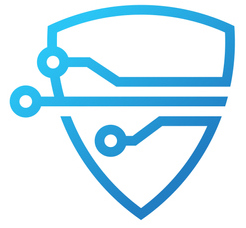
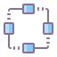

## Work History

I started my career right out of high-school with a [focus on network security](#work-intrusic), 
subsequently inventing one of the first systems to detect sophisticated covert channels over a network. 
After that, I co-founded a [professional-services firm](#work-jd) focused on
delivering mission-critical enterprise software, which grew
organically for over a decade up to a successful exit. We subsequently spun out 
a [decentralized software startup](#work-jd-decentralized) (albeit under
the same brand) that we'd incubated since 2018.

Wearing all kinds of hats over the years has given me a diverse skillset 
and a whole lot of perspective. 

* I've been a developer churning out code to hit critical product deadlines
  in just about every major language and operating environment.

* I've led teams and architected massive systems across a range of industries,
  from financial trading systems managing billions of dollars, to a monitoring
  and diagnostic system ensuring the safe generation and distribution of nuclear, 
  wind, natural gas, and clean coal for the largest independent generator of 
  energy in the United States.

* I've worked the phones for hours on end in [customer support](#work-shorenet).

* I've been the technical ringer for sales teams, marrying business needs to
  technical solutions on the fly, turning leads into opportunities, and providing
  the concrete guidance and strategy needed to move deals across the line
  with some of the biggest and most innovative companies in the world.

* I've authored, edited, and implemented [open standards](decentralized) for
  decentralized Web3 ecosystems.

* I [led a research team](#work-intrusic) of PhDs, cryptographers, astrophysicists, and 
  reformed hackers, and came up with novel ways to detect covert channels
  in encrypted communication streams.

* I've modified opens source kernels to [optimize data processing](#work-intrusic).

* I've seen good ideas and great technologies fail because the market wasn't ready 
  for them, because timing is everything.
  
* I've [raised](#work-intrusic) millions of dollars 
  from top-tier venture capital firms, and I've grown companies [organically](#work-jd) 
  that generated millions of dollars in annual revenue from nothing. 

I've learned from
enough of my failures to appreciate my successes, and that my best skill
is being able to work backwards from real-world problems to
solutions that move the needle for a business, industry, or community.
   
----

### CTO / Co-Founder @ Janeiro Digital
{: #work-jd}

#### Decentralized Software
{: #work-jd-decentralized}

**2018 - Present**

Our revolutionary [XFORM](https://www.janeirodigital.com/xform/) platform seamlessly integrates decentralized 
ecosystems with the rest of the world (and each other). Incubated within my 
[professional services business](#work-jd-services), we spun it out in 2021.
As CTO I'm responsible for the product roadmap, system architecture, and 
execution of the software delivery team.

- [XFORM](https://www.janeirodigital.com/xform/) is one of the 
  first commercial systems to integrate enterprise applications and systems with 
  decentralized data, protocols, and identities.
- Early customers include UK [National Health Service](https://nhs.uk),
  [Zurich Insurance](https://www.zurich.com/), and [Novartis](https://novartis.com) 
- Partnerships with [RSA Labs](https://www.janeirodigital.com/blog/new-partnership-brings-enterprise-security-to-the-decentralized-web/), 
  [Inrupt](https://inrupt.com), [KPMG](https://home.kpmg/), and [Deloitte](https://www.deloitte.com/)

#### Professional Services
{: #work-jd-services}

**2008 - 2021**

I co-founded Janeiro Digital in 2009; a professional services business that
specialized in building massively scalable, data intensive systems and
applications for large enterprises. Overseeing the technology and creative divisions, 
I pioneered our RADD methodology for precise delivery of mission-critical 
enterprise software. We grew it organically from day one through a successful exit in 2021.
[[1]](https://www.inc.com/peter-cohan/i-was-blown-away-by-how-these-brothers-built-a-25.html)

* 100% organic growth from day one to a successful exit in 2021
* Listed as a ["Vendor to Watch"](https://www.businesswire.com/news/home/20170315005824/en/Janeiro-Digital-Named-a-Vendor-to-Watch-by-Gartner)
  by Gartner, and a [Gartner Cool Vendor](https://www.businesswire.com/news/home/20170518005703/en/Janeiro-Digital-Named-a-Business-and-IT-Services-Cool-Vendor-by-Gartner)
* Customers included [Amazon](https://amazon.com), [Caterpillar](https://www.caterpillar.com/), 
  [IBM](https://ibm.com), [Wayfair](https://wayfair.com), [UTC](https://www.rtx.com/), 
  and [Vistra Energy](https://vistracorp.com/)

----

### Editor @ Solid
{: #work-solid}

**2018 - Present**

Author, reviewer, and contributor of multiple open specifications in the [Solid Ecosystem](https://solidproject.org), 
including the core [Solid Protocol](https://solidproject.org/TR/protocol), 
[Application Interoperability Standard](https://solid.github.io/data-interoperability-panel/specification/),
[Authentication Protocol](https://solid.github.io/solid-oidc/), [Shape Trees](https://shapetrees.org/TR/specification/),
and a range of [developer libraries](decentralized). Led the first draft and subsequent 
approval of the ecosystem [governance process](https://github.com/solid/process).

----

### Mentor @ Techstars
{: #work-techstars}

**2013 - Present**

Leveraging my experience building companies and technology to help some really 
awesome young startups navigate the (sometimes) choppy waters. Have been lucky to
mentor some great companies like [Codeship](https://www.cloudbees.com/products/codeship), 
[SynAck](https://www.synack.com/), and others.

----

### CTO / Co-Founder @ Intrusic
{: #work-intrusic}

**2002 - 2007**

Designed and built a next generation compromise detection system using passive 
network analysis and advanced data classification algorithms to identify 
hacked internal networks without the need for specific attack signatures. [[1]](https://www.baltimoresun.com/news/bs-xpm-2004-03-04-0403040090-story.html)
[[2]](https://www.eweek.com/security/security-start-up-seeks-to-spot-solve-compromises/)

- Invented and built one of the first systems to detect sophisticated covert
channels over a network
- Customers included [Dupont](https://www.dupont.com/), [Reebok](https://reebok.com), 
  [Avid](https://avid.com), and [Bank of America](https://bankofamerica.com).  

----

### Systems Engineer @ Shore.net 
{: #work-shorenet}

**1998 - 2001**

My first job in tech, which I started while in high-school as a customer support
technician. Ultimately became responsible for managing, securing, and monitoring 
the service provider network. I used and expanded on a range of
open-source tools available at the time. I was able to identify some key problems 
in securing large networks that led to the founding of my first startup.
